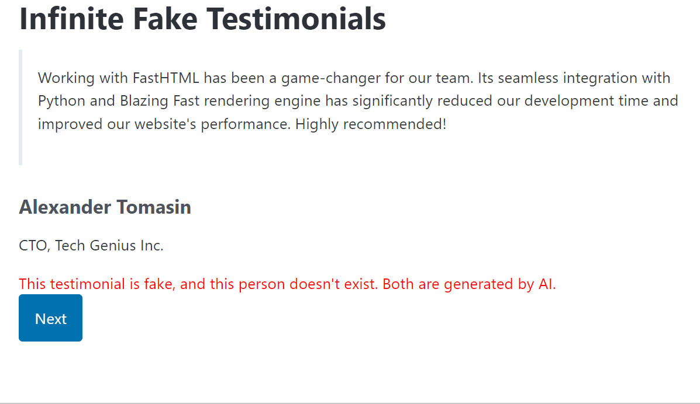

# Infinite Fake Testimonials

This is a demo of [FastHTML](https://fastht.ml/) that dynamically generates and displays AI-generated testimonials using [Outlines](https://github.com/outlines-dev/outlines) for Structured Generation. This project showcases how seamlessly technology integrates to enhance web content delivery, [inspired by the possibilities of structured data generation](https://x.com/_scottcondron/status/1828801744853516777) from LLMs.

See the **live demo** [here](https://aastroza--outlines-app-get.modal.run/).

## How it works

We define a structured object that FastHTML renders.

```python
class Testimonial(BaseModel):
    quote: str
    name: str
    role: str
    company: str

    def __ft__(self):
        return Div(
            Blockquote(P(self.quote)),
            H4(self.name),
            P(f"{self.role}, {self.company}"),
        )
```

Then we create a function for JSON-structured data generation using Outlines.

```python
def generate_testimonial_card() -> Testimonial:
    result = m.generate.remote(schema.strip(),  prompt_template.format(schema=schema.strip(), examples=examples))
    return Testimonial(**result)
```

Every time the user clicks the `Next` button, a new fake testimonial is generated and displayed.

## LLM generation on the cloud with Modal

First, install the [Modal](https://modal.com/) client:

```bash
pip install modal
```

Then, you need to obtain a token from Modal. Run the following command:

```bash
modal setup
```

Once that is set, you can setup the Modal app by running:

```bash
modal deploy deploy.py
```

You see the Modal app initialize, and then you can start using it.