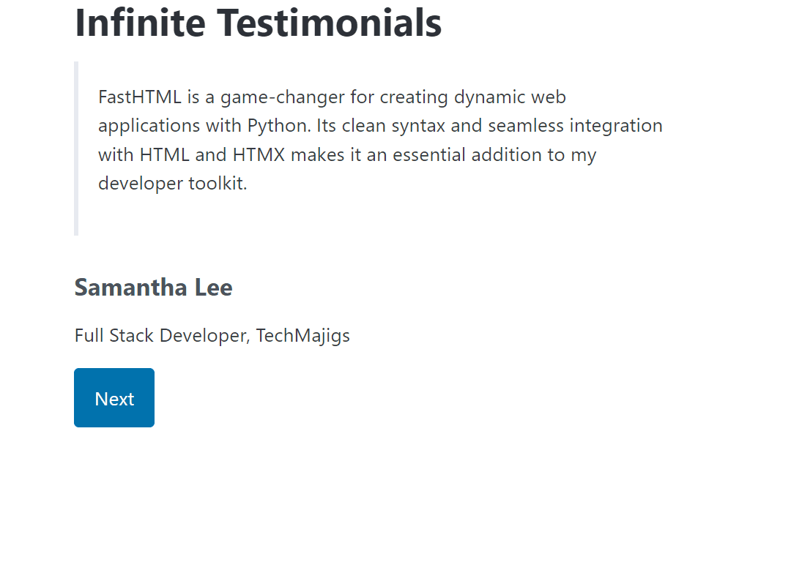

# Infinite Testimonials



This is a [FastHTML](https://fastht.ml/) demo that dynamically generates and displays AI-powered testimonials using [Outlines](https://github.com/outlines-dev/outlines) for Structured Generation. [Inspired by the possibilities of structured data generation](https://x.com/_scottcondron/status/1828801744853516777) from LLMs, this project showcases how seamlessly technology can integrate to enhance web content delivery.

## How it works

We define a structured object that can be rendered by FastHTML.

```python
class Testimonial(BaseModel):
    quote: str
    name: str
    role: str
    company: str

    def __ft__(self):
        return Div(
            Blockquote(P(self.quote)),
            H4(self.name),
            P(f"{self.role}, {self.company}"),
        )
```

Then we create a function for JSON-structured data generation using Outlines.

```python
def generate_testimonial_card() -> Testimonial:
    result = m.generate.remote(schema.strip(),  prompt_template.format(schema=schema.strip(), examples=examples))
    return Testimonial(**result)
```

So every time the user click the `Next` button, a new testimonial is LLM-generated and displayed.

## LLM generation on the cloud with Modal

First install the Modal client:

```bash
pip install modal
```

You then need to obtain a token from Modal. Run the following command:

```bash
modal setup
```

Once that is set you can setup the Modal app by running:

```bash
modal deploy transformers_outlines.py
```

You should see the Modal app initialize, and then you can start using it.